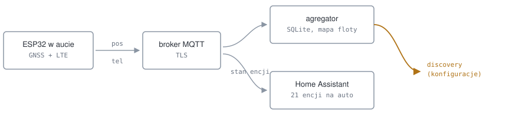
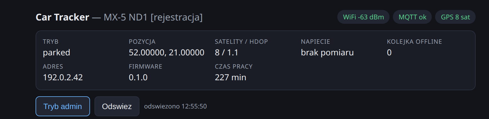
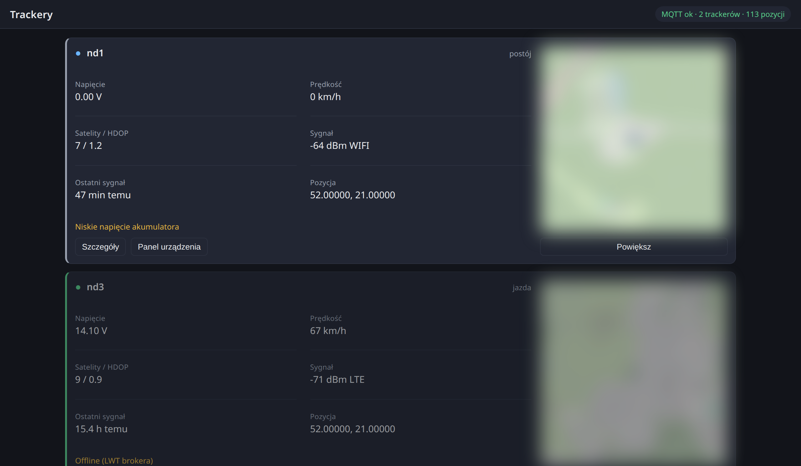

# car-tracker

An OBD-powered GPS/LTE tracker for three Mazda MX-5s (ND1 2016, ND3 2025, NB
facelift), reporting to Home Assistant over MQTT.

> **Status: prototype.** Nothing is installed in a car yet. The device works on a
> bench: it gets a GNSS fix, publishes over WiFi to an MQTT broker, and its
> entities appear in Home Assistant. Everything beyond that — LTE, power from the
> OBD socket, the current budget, reading data off the vehicle bus — is designed
> and documented but not yet measured on a real car. Claims that depend on such a
> measurement are marked `[DO ZMIERZENIA]` in the docs and are not presented as
> facts.

The repository holds the whole thing: assumptions, hardware trade-offs, the power
design, ESP32 firmware, the MQTT contract, and the Home Assistant side.



The aggregator publishes the *discovery configs* that create the Home Assistant
entities, but the state of most of them is read straight from the device's own
topics. A stopped aggregator therefore costs only the trip sensors; battery
voltage and the tow alarm never pass through it.

## What works today

- **GNSS on the bench.** NEO-6M, 3D fix, HDOP 1.6 with 6 satellites indoors,
  151 s cold start. Numbers and method in `hardware/pomiary.md`.
- **Firmware builds** in five environments (`wifi_dev` plus four modem variants)
  and two standalone probes.
- **On-device configuration portal.** Vehicle identity, WiFi, an emergency access
  point, MQTT with a pasted CA, LTE, every hardware pin, OTA. Settings live in
  NVS, so `config.h` is only a factory default.

  

  *Status bar served by the ESP32 itself. Registration, position and address are
  redacted in this screenshot.*
- **Offline queue.** Positions taken without a link are stored and flushed later,
  deduplicated by sequence number at the receiving end.


*Fleet overview. Map thumbnails are blurred and coordinates replaced in this
screenshot; the `0.00 V` on the first vehicle is real, because a bench board has
no voltage divider fitted.*

- **Home Assistant entities via MQTT discovery**, 21 per vehicle: position,
  battery voltage, mode, satellites, HDOP, signal, queue depth, trip statistics,
  a tow alarm, and buttons for locate and ping. Verified end to end: pressing the
  locate button in HA produced a position on the map matching what the device
  reported, accuracy included.

## What does not work yet

- **No LTE.** The transport abstraction and four modem environments exist and
  compile; no modem has been connected. Three boards are on order.
- **No power from the OBD socket.** The design is in `docs/04`, but the current
  budget has not been measured and the undervoltage cutoff has not been proven.
  Until both are done, the device runs off a power bank. This is deliberate: a
  tracker that flattens a car battery is worse than no tracker.
- **No data from the vehicle.** Reading the CAN bus is planned and a sniffing
  probe is written, but no transceiver has been connected to a car.
- **Nothing measured on a car.** Idle current draw, the voltage profile, and
  whether OBD pin 16 stays live after the car sleeps are all still open.

## Layout

| Directory | Contents |
|---|---|
| `docs/` | Design in fourteen chapters: PoC scope, assumptions, architecture, hardware options, OBD power, MQTT protocol, CAN phase 2, firmware, HA integration, security, per-vehicle differences, rollout plan, bring-up log, configuration portal |
| `firmware/` | PlatformIO project, five build environments |
| `firmware/probe/` | Standalone GNSS bring-up probe: baud scan, pin sweep, NMEA diagnostics over HTTP |
| `firmware/probe-can/` | Standalone CAN probe: bit rate scan, per-ID table with a changed-byte mask, change log, CSV export. Listen-only |
| `ha-integration/` | Custom component, superseded by MQTT discovery and kept as reference |
| `hardware/` | Measurements, BOM, enclosure |
| `tools/` | Telemetry simulator for testing without hardware |

## Design decisions worth knowing

- **The device stays dumb.** Trip distances, deduplication and plausibility
  filtering happen in the aggregator, not in the firmware. A device in a car under
  a dashboard is the worst place to debug logic.
- **Nothing is written to the vehicle bus.** Phase 2 listens to frames the car
  broadcasts anyway. Querying wakes modules that have just gone to sleep, so it is
  allowed only with the engine running.
- **The car battery wins.** The undervoltage cutoff is set to leave the battery
  enough to start the engine, not to keep the tracker alive.
- **Home Assistant reads the device directly.** Discovery configs are published by
  the aggregator, but most entities point their state topic at the device's own
  topics, so a stopped aggregator costs only the trip sensors.

## Getting started

The PoC deliberately uses only hardware already on hand: an ESP32 and a NEO-6M,
over WiFi, powered by USB. Read `docs/00-poc.md` first — it states what the PoC
does and does not prove.

```bash
cd firmware
cp src/config.example.h src/config.h   # gitignored, fill in from your password manager
pio run -e wifi_dev -t upload
pio device monitor
```

Point Home Assistant's MQTT integration at the same broker and the entities appear
on their own.

## Next steps

1. **Take the PoC outdoors and into a car.** Fix quality in town, track fidelity
   through corners, and above all: turn the hotspot off mid-route, because losing
   WiFi is the same case as losing LTE and it tests the offline queue without
   buying a modem. Closing criteria in `docs/00-poc.md` section 0.6.
2. **Measure the cars before fitting anything.** Idle draw as a baseline, voltage
   on OBD pin 16 with the ignition off, on, and running, and whether that pin dies
   after the car sleeps. If it dies, the parked-state design has to change.
3. **Bring up the LTE boards** when they arrive, and confirm the full part number
   of the radio module: on this family a suffix decides whether GNSS is present.
4. **Build the power path** from `docs/04`: fuse, transient protection, buck
   converter, load switches. Measure deep-sleep draw on a bench supply before the
   device spends a night in a car.
5. **Sniff the CAN bus on the ND1** with the probe: confirm which pins carry which
   bus and at what rate, then find the frames carrying fuel level, coolant
   temperature and gear, which are not publicly documented for this generation.
6. **Check the NB facelift's OBD socket.** Its year predates mandatory CAN, so it
   most likely carries a K line, on which there is nothing to listen to. That
   changes what phase 2 can mean for that car.
7. **Put authentication in front of the fleet page**, which is currently open by
   deliberate choice while this is a prototype.

## Conventions

- Code, comments, commit messages and filenames are in English. This README is in
  English; the rest of `docs/` is in Polish.
- Secrets never enter the repository. `firmware/src/config.h` and the probes'
  `secrets.h` are gitignored; the repo carries only `*.example.h` templates.
- Anything not actually measured is marked `[DO ZMIERZENIA]` rather than written
  as a fact.

## Licence

MIT, see `LICENSE`.
